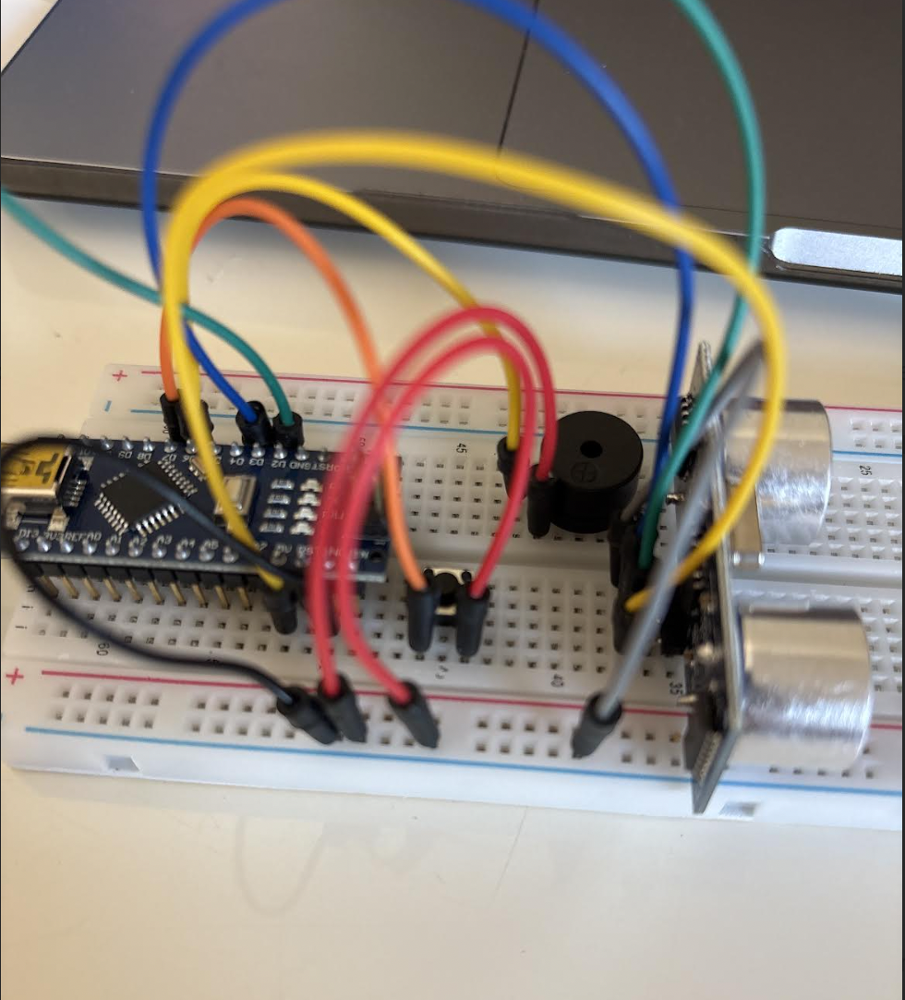

# Third Eye for the Blind
This project is a compact, portable device designed to assist visually impaired individuals by alerting them to nearby obstacles. It uses an ultrasonic sensor to detect objects within a specific range. When an obstacle is detected, the device emits a beeping sound and activates a vibrating motor and LED light simultaneously. Lightweight, affordable, and efficient, the "Third Eye" offers an innovative solution to enhance mobility and safety for people with visual impairments.

```HTML 
<!--- This is an HTML comment in Markdown -->
<!--- Anything between these symbols will not render on the published site -->
```

| **Engineer** | **School** | **Area of Interest** | **Grade** |
|:--:|:--:|:--:|:--:|
| Rachel C | Leigh High School | Electrical Engineering | Incoming Sophmore


  
# Final Milestone

**Don't forget to replace the text below with the embedding for your milestone video. Go to Youtube, click Share -> Embed, and copy and paste the code to replace what's below.**

<iframe width="560" height="315" src="https://www.youtube.com/embed/F7M7imOVGug" title="YouTube video player" frameborder="0" allow="accelerometer; autoplay; clipboard-write; encrypted-media; gyroscope; picture-in-picture; web-share" allowfullscreen></iframe>

- I've added an led that lights up with the buzzer when the buzzer is buzzer and it'll turn off if the buzzer isnt buzzing
- I've adjusted the tone of the buzzer so that it'll get louder as any objects get closer
- I've gained a lot of insight about the engineering field from this experience which helps me get a good perspective that I can keep in mind as I'm still unsure of what field I wanna pursue
- I've learned some basic circuiting and how to use arduino, nano, and to build onto breadboards and also how to do some code to implement my project like coding for multiple hardware like the led, buzzer, and ultrasonsic sensor to work together
- I hope to be able to apply my knowledge into a harder project or if I had more time I would have used the modification with bluetooth wifi since it's build into the esp32 nano and would connect to an app or website that will automatically have the data of the ultrasonic sensor and components from my project


# Second Milestone

**Don't forget to replace the text below with the embedding for your milestone video. Go to Youtube, click Share -> Embed, and copy and paste the code to replace what's below.**

<iframe width="384" height="682" src="https://www.youtube.com/embed/UbVxrZwSebs" title="Rachel C. Milestone 2" frameborder="0" allow="accelerometer; autoplay; clipboard-write; encrypted-media; gyroscope; picture-in-picture; web-share" referrerpolicy="strict-origin-when-cross-origin" allowfullscreen></iframe>
- I built the ultrasonic sensor and buzzer into the breadboard for the hardware and used jumper wires to plug them into the nano for a good connection and have the nano pluged into a power bank to make it more compact and accessable in more mobile use 
- There were some difficulties with the hardware and debugging figuring out which physical component wasn't working since the ulrasonic senor wasn't detecting any distance for any objects in motion 
- Some of the physical hardware components had stopped working or malfunctioned which caused some delay during the building process but we worked around it and figured out other solutions like using jumperwire and connecting it directly to the nano
- Learned to incorporate codes for different physical hardware parts together like the buzzer and the ultrasonic sensor together
- I still need to work on modifications and see if there are any components I can add to improve my projects for my final milestone

# First Milestone

**Don't forget to replace the text below with the embedding for your milestone video. Go to Youtube, click Share -> Embed, and copy and paste the code to replace what's below.**

<iframe width="384" height="682" src="https://www.youtube.com/embed/pCNd_KK011c" title="Rachel C. Milestone 1" frameborder="0" allow="accelerometer; autoplay; clipboard-write; encrypted-media; gyroscope; picture-in-picture; web-share" referrerpolicy="strict-origin-when-cross-origin" allowfullscreen></iframe> 

I achieved my first milestone by learning and understanding circuit fundamentals which is incorporated in my project as I learned how to connect the ultrasonic sensor into the breadboard which is a crucial part for my project. I also learned how to use example codes and how to effectively change them to fit into the circumstances of your project. 
- Technical progress I've made so far is building the ultrasonic sensor but once I tried to add the buzzer there were so technical difficulties including the nanos so I wasn't able to showcase it in my video
- Challenges with building the hardware since some of my nanos broke and having the code altered to respond to the hardware
- Use ultrasonic sensor and buzzer to detect objects within a certain distance to notify user of obstacles in front


hardware for the ultrasonic senor, a button, and a buzzer to track objects in motion within a certain distance to alert user 

# Schematics 
Here's where you'll put images of your schematics. [Tinkercad](https://www.tinkercad.com/blog/official-guide-to-tinkercad-circuits) and [Fritzing](https://fritzing.org/learning/) are both great resoruces to create professional schematic diagrams, though BSE recommends Tinkercad becuase it can be done easily and for free in the browser. 

# Code
This Arduino code uses an ultrasonic sensor to measure how far away an object is. It sends out a sound wave from the trigger pin, waits for it to bounce back, and measures how long it takes to return using the echo pin. The code then calculates the distance based on the time it took. If the object is closer than 10 centimeters, a buzzer turns on and makes a sound. If the object is farther away, the buzzer stays off. The distance is also printed on the Serial Monitor so you can see how far the object is in real-time. The led turns on when the buzzer is buzzing and turns off when the buzzer is isnt buzzing and by adjusting and customizing the tone of the buzzer, the closer an object is, the louder the buzzer will get.

```c++
const int trigPin = 6;
const int echoPin = 5;
const int buzzerPin = 11;

float duration, distance, frequency;

void setup() {
  pinMode(trigPin, OUTPUT);
  pinMode(echoPin, INPUT);
  Serial.begin(9600);
  
  pinMode(3, OUTPUT); 

}

void loop() {
   digitalWrite(trigPin, LOW);
  delayMicroseconds(2);
  digitalWrite(trigPin, HIGH);
  delayMicroseconds(10);
  digitalWrite(trigPin, LOW);

  duration = pulseIn(echoPin, HIGH);
  distance = (duration*.0343)/2;
  Serial.print("Distance: ");
  Serial.println(distance);
  if (distance < 10){
  frequency = 2000 - distance * 40;
      tone(buzzerPin, frequency);
      digitalWrite(3, HIGH);
  }
  else {
      noTone(buzzerPin);
      digitalWrite(3, LOW);
  }
  delay(100);
}
```


# Bill of Materials
Here's where you'll list the parts in your project. To add more rows, just copy and paste the example rows below.
Don't forget to place the link of where to buy each component inside the quotation marks in the corresponding row after href =. Follow the guide [here]([url](https://www.markdownguide.org/extended-syntax/)) to learn how to customize this to your project needs. 

| **Part** | **Note** | **Price** | **Link** |
|:--:|:--:|:--:|:--:|
| Elegoo Nano | Holds Arduino code that powers and controls the functions of the project | $15.99 | <a href="(https://www.amazon.com/ELEGOO-Pre-soldered-ATmega-Compatible-Arduino/dp/B0D5LYFRQP/ref=asc_df_B0D5LYFRQP?mcid=6209a06fe54b329b8f388f925a49049d&hvocijid=551142160124510110-B0D5LYFRQP-&hvexpln=73&tag=hyprod-20&linkCode=df0&hvadid=721245378154&hvpos=&hvnetw=g&hvrand=551142160124510110&hvpone=&hvptwo=&hvqmt=&hvdev=c&hvdvcmdl=&hvlocint=&hvlocphy=9032178&hvtargid=pla-2281435179298&psc=1)"> Link </a> |
| Stem Bundle Electronic Components Kits | Contains buzzer, led, wires, to build and customtize project | $14 | <a href="https://www.amazon.com/Arduino-A000066-ARDUINO-UNO-R3/dp/B008GRTSV6/"> Link </a> |
| Ultrasonic Sensor | Detect motion of objects | $9.99 | <a href="https://www.amazon.com/Arduino-A000066-ARDUINO-UNO-R3/dp/B008GRTSV6/"> Link </a> |
| DMM | Used to test connection on wires and nano and sensors | $11 | <a href="https://www.amazon.com/Arduino-A000066-ARDUINO-UNO-R3/dp/B008GRTSV6/"> Link </a> |
| USB -- USBC Adapter | Making sure the wires are compatible to be able to connect it onto computer and start code | $9.99 | <a href="https://www.amazon.com/Arduino-A000066-ARDUINO-UNO-R3/dp/B008GRTSV6/"> Link </a> |
| USB power bank & cable | Used as a power source to make the device more portable to take around | $16.19 | <a href="https://www.amazon.com/Arduino-A000066-ARDUINO-UNO-R3/dp/B008GRTSV6/"> Link </a> |
| ESP32 Nano | Holds Arduino code that powers and controls the functions of the project but also has added in wifi and bluetooth functions | $20.9 | <a href="https://www.amazon.com/Arduino-A000066-ARDUINO-UNO-R3/dp/B008GRTSV6/"> Link </a> |

# Other Resources/Examples
- [Example 1]((https://www.circuitbasics.com/how-to-use-active-and-passive-buzzers-on-the-arduino/))
- [Example 2]((https://projecthub.arduino.cc/SBR/working-with-an-led-and-a-push-button-d34b17))
- [Example 3]([https://arneshkumar.github.io/arneshbluestamp/](https://www.instructables.com/Arduino-Nano-Compatible-LEDs/))
- [Example 4]((https://howtomechatronics.com/tutorials/arduino/ultrasonic-sensor-hc-sr04/))


